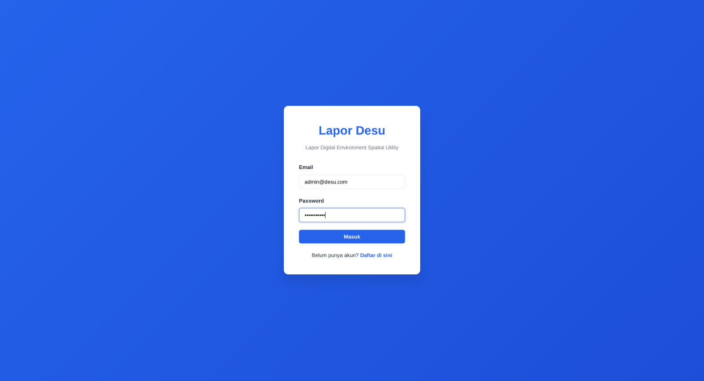
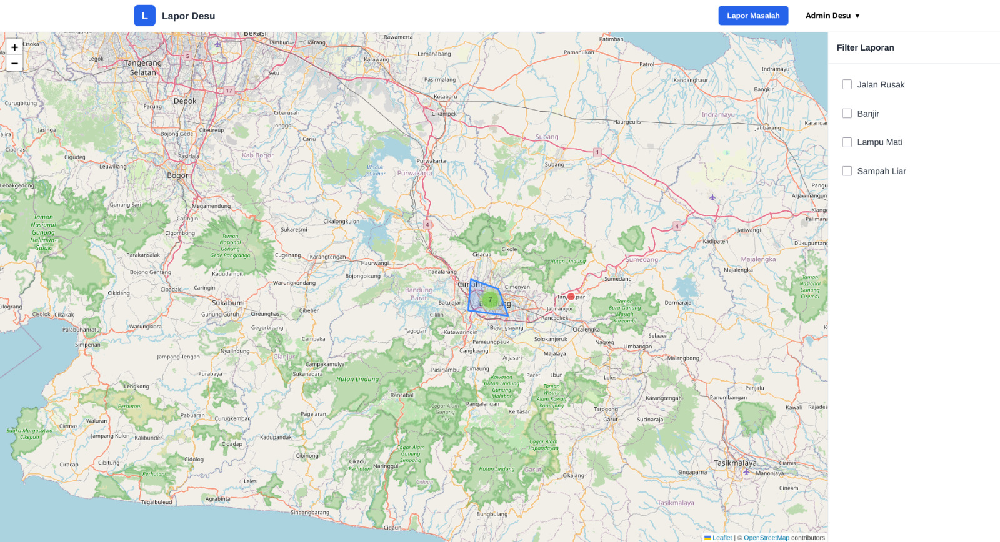
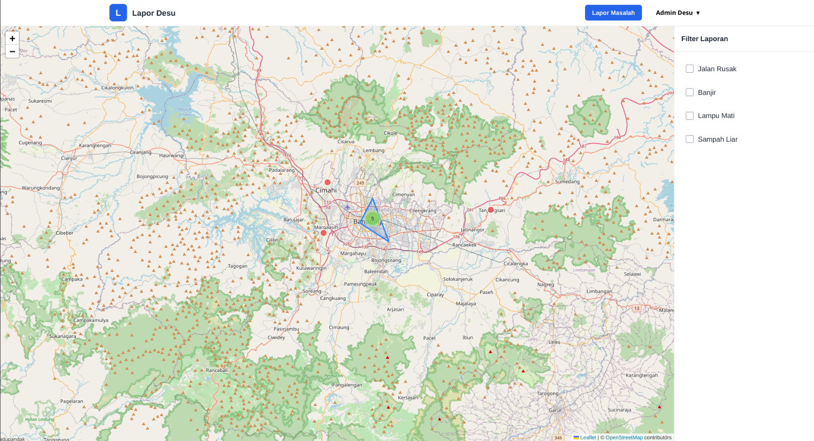
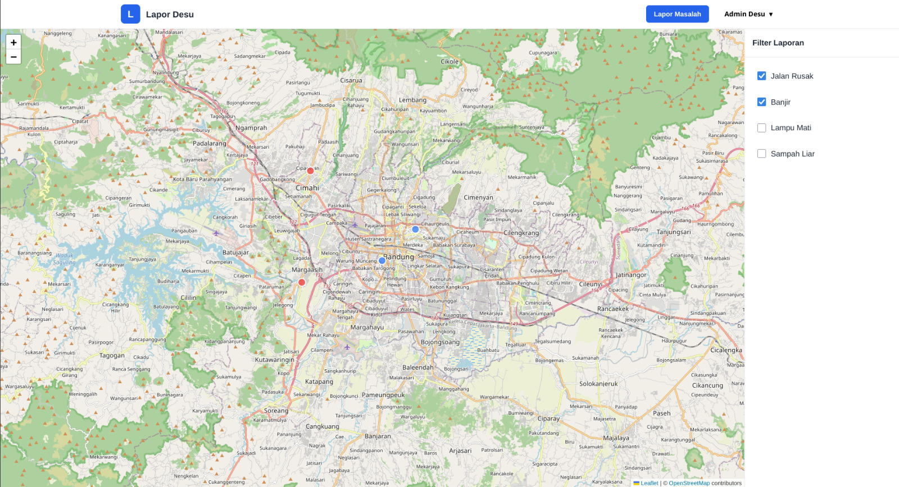
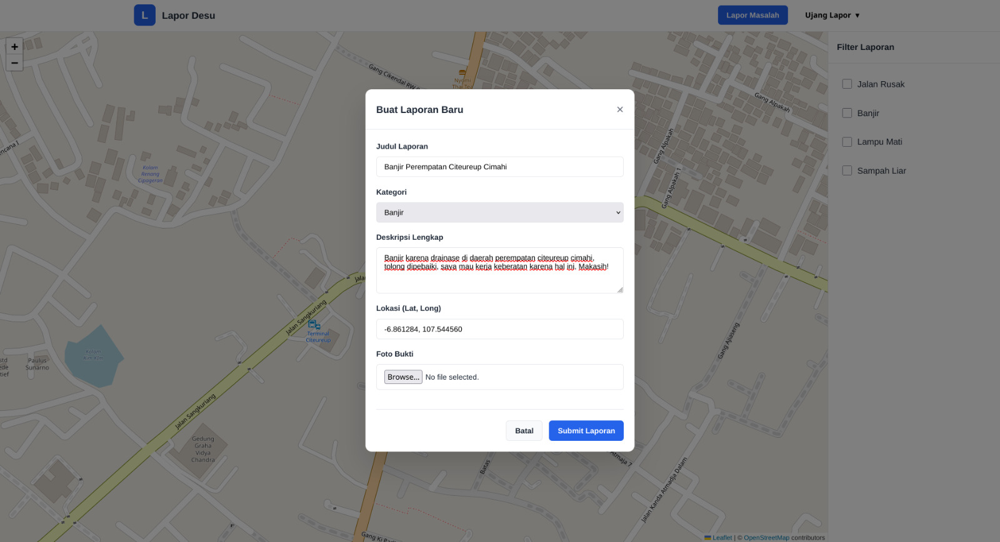
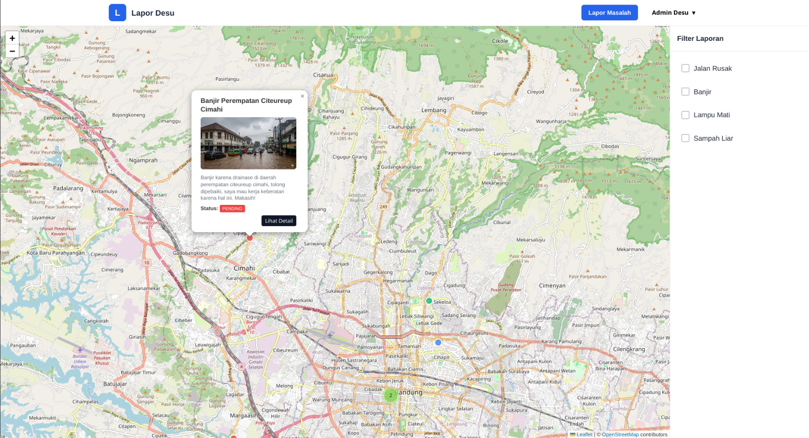
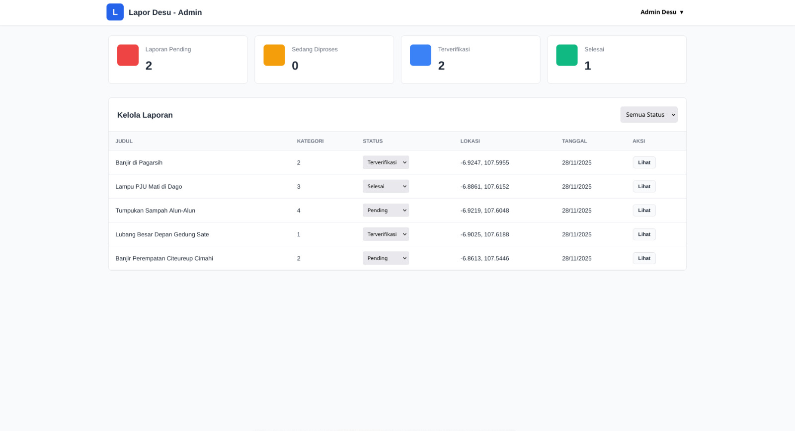

# Lapor Desu

Lapor Desu (Lapor Digital Environment Spatial Utility) adalah aplikasi pelaporan masalah lingkungan/fasilitas kota berbasis peta interaktif. Pengguna (reporter) dapat membuat laporan dengan titik lokasi, kategori, deskripsi, dan foto bukti. Admin dapat memverifikasi, menyelesaikan, atau menolak laporan melalui dashboard khusus.

## Fitur Utama

- Pembuatan laporan geospasial (latitude / longitude) langsung via klik pada peta.
- Upload foto bukti (tersimpan di Supabase Storage – opsional jika dikonfigurasi).
- Kategori laporan dinamis (disemai via seeder).
- Status laporan: `pending`, `verified`, `resolved`, `rejected`.
- Autentikasi JWT (register & login).
- Admin dashboard untuk memantau & mengubah status laporan.
- Pop–up marker dengan thumbnail gambar + tombol "Lihat Detail" (modal detail).
- Marker clustering (Leaflet MarkerCluster) agar peta tetap ringan saat banyak laporan.
- API terstruktur mengembalikan GeoJSON FeatureCollection untuk fleksibilitas spasial.
- Single Docker image: Flask + Frontend statis (siap untuk Coolify).

## Dokumentasi

Berikut beberapa tampilan antarmuka aplikasi:










## Teknologi

| Layer | Teknologi |
|-------|-----------|
| Backend | Python, Flask, Flask-SQLAlchemy, Flask-CORS, PyJWT |
| Database | PostgreSQL (Neon) |
| Storage Gambar | Supabase Storage |
| Frontend | HTML/CSS/JS (Vanilla), Axios, Leaflet, MarkerCluster |
| Bundling | Docker (Gunicorn), Coolify-ready |

## Struktur Direktori Singkat

```
backend/
	app.py                # Aplikasi Flask (serve API + static frontend)
	models.py             # Definisi ORM (User, Category, Report)
	seed.py               # Seeder (reset + isi data dasar)
	requirements.txt      # Dependency backend
frontend/
	index.html, login.html, register.html, dashboard.html, admin.html
	js/ (config, api-client, auth, map-manager, pages/*)
	css/style.css
docs/                   # Screenshot dokumentasi
Dockerfile              # Image produksi (Flask + frontend static)
.dockerignore
readme.md
```

## Environment Variables

Letakkan di Coolify atau file `.env` (jangan commit ke repo publik):

| Nama | Wajib | Deskripsi |
|------|-------|-----------|
| `DATABASE_URL` | Ya | URL koneksi Postgres (Neon). Jika format `postgres://` otomatis diubah ke `postgresql://`. |
| `SECRET_KEY` | Ya | Secret untuk signing JWT. |
| `SUPABASE_URL` | Tidak* | URL Supabase project. Diperlukan jika ingin upload gambar. |
| `SUPABASE_KEY` | Tidak* | Service key Supabase. Diperlukan jika ingin upload gambar. |
| `BUCKET_NAME` | Tidak* | Nama bucket public Supabase. |

Jika ketiga variabel Supabase tidak di-set, fitur upload gambar akan dinonaktifkan (backend akan mengembalikan error jika file dikirim). Laporan tetap bisa dibuat tanpa gambar.

## Menjalankan Secara Lokal

```bash
# 1. Buat & aktifkan virtualenv (opsional)
python -m venv .venv
source .venv/bin/activate

# 2. Install dependency
pip install -r backend/requirements.txt

# 3. Jalankan backend (dev)
python backend/app.py

# Aplikasi akan berjalan di http://127.0.0.1:5000
# Frontend dilayani langsung oleh Flask (index.html pada /)
```

## Seeder (Data Awal)

Seeder akan:
- Drop semua tabel
- Membuat ulang tabel
- Menambah user admin + beberapa reporter
- Menambah kategori
- Menambah beberapa laporan contoh (Bandung area)

Jalankan:
```bash
python backend/seed.py
```

## Deploy dengan Docker (Coolify Ready)

Dockerfile telah disiapkan untuk menyajikan frontend + backend dalam satu container via Gunicorn.

Build manual:
```bash
docker build -t lapor-desu .
docker run -p 8080:5000 \
	-e DATABASE_URL="postgresql://..." \
	-e SECRET_KEY="super-secret" \
	-e SUPABASE_URL="https://xyz.supabase.co" \
	-e SUPABASE_KEY="service-key" \
	-e BUCKET_NAME="public" \
	lapor-desu

# Akses di http://localhost:8080
```

### Deploy di Coolify
1. Tambah aplikasi baru → Source: Git Repository → pilih repo ini.
2. Coolify otomatis mendeteksi Dockerfile di root.
3. Set environment variables (lihat tabel di atas).
4. Deploy → Aplikasi akan berjalan di port internal 5000 (Coolify akan melakukan routing ke domain publik).
5. Pastikan domain mengarah ke root (`/`) → index.html served, API di `/api/v1/*`.

## Endpoint API (Ringkas)

Semua endpoint diprefiks `/api/v1`.

| Method | Path | Deskripsi |
|--------|------|-----------|
| GET | `/api/v1/test-db` | Cek koneksi database + jumlah laporan. |
| POST | `/api/v1/auth/register` | Register (name, email, password) → JWT token. |
| POST | `/api/v1/auth/login` | Login → JWT token. |
| GET | `/api/v1/categories` | Ambil daftar kategori. |
| GET | `/api/v1/reports` | Ambil semua laporan (GeoJSON FeatureCollection). |
| POST | `/api/v1/reports` | Buat laporan baru (multipart/form-data atau JSON). |
| GET | `/api/v1/reports/<id>` | Detail laporan. |
| PATCH | `/api/v1/reports/<id>` | Update status / judul / deskripsi / gambar baru. |
| DELETE | `/api/v1/reports/<id>` | Hapus laporan. |

Contoh respons GET `/api/v1/reports` (dipotong):
```json
{
	"type": "FeatureCollection",
	"features": [
		{
			"type": "Feature",
			"geometry": { "type": "Point", "coordinates": [107.61881, -6.902481] },
			"properties": { "id": 1, "title": "Lubang Besar Depan Gedung Sate", "status": "pending" }
		}
	]
}
```

## Arsitektur Sederhana

```
[Leaflet Frontend] -- same origin --> [Flask API + Static]
															|--> PostgreSQL (SQLAlchemy ORM)
															|--> (Optional) Supabase Storage untuk gambar
```


## Pengujian Manual Penting

1. Register → Login → Pastikan token tersimpan di `localStorage` (`auth_token`).
2. Buat laporan tanpa gambar → sukses.
3. Buat laporan dengan gambar (jika Supabase dikonfigurasi) → image_url tersimpan & tampil di popup.
4. Ubah status laporan via Admin → refleksi warna marker (re-load map).
5. Cek GeoJSON: `curl /api/v1/reports`.

## Keamanan & Catatan

- Gunakan SECRET_KEY unik per environment.
- Validasi mime upload gambar (kode sudah membatasi ke JPEG/PNG/WEBP/GIF).
- Gunicorn + multiple worker sudah disiapkan (sesuaikan jumlah worker berdasarkan CPU).
- Tambahkan reverse proxy (Coolify/Nginx) untuk TLS + gzip jika perlu.

## Pengembangan Lanjutan (Ide)

- Endpoint statistik server-side (`/api/v1/reports/statistics`).
- Role-based middleware untuk admin-only actions.
- Pagination & bounding box query (filter spasial).
- Notifikasi (email / webhook) saat laporan diverifikasi.
- Cache GeoJSON (Redis) untuk performa skala besar.

## Lisensi

Project ini dapat digunakan untuk kebutuhan pembelajaran / internal. Tambahkan lisensi eksplisit bila akan dipublikasikan lebih luas.

---
Selamat membangun & semoga bermanfaat!
